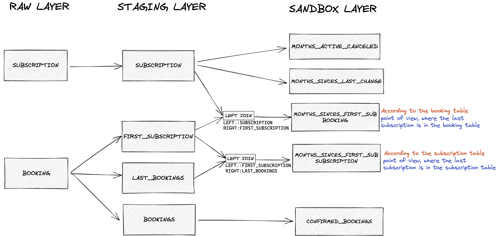
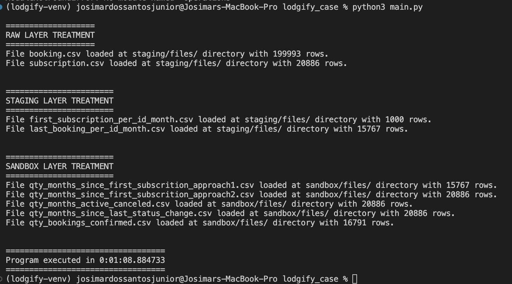

# lodgify_case

## Introduction

As the result expected for this program, like it's in the "Python Challenge.pdf" file, is to create python a script to generate files that would answer four questions, these answer are loaded inside the directory sandbox/files as CSV files (as requested).

That's a program that take 2 files as input - subscription.csv and booking.csv -, clean and manipulate them to let them readble to be accessable by anyone and to facilitate to respond the questions asked on the [Challenge](Python%20Challenge.pdf).

The execution is divided by layers - raw, staging, sandox - for each file, where in the raw layers there are the input files and the data cleaning step, staging layer there are files manipulated and agg functions, and sandbox layer that use staging as input to create files/tables as answer of the questions asked.

## Layers

**RAW**<br />
Cleaning and columns needed added to booking and subscription files.
<br />
###### booking
 - CSV Reading
 - Filtering only the necessary columns
 - Check for duplicates
 - Handling missing data
 - Create columns to be used in next steps
 - Create primary key
 - Set datetime load 
###### subscription
 - CSV Reading
 - Filtering only the necessary columns
 - Check for duplicates
 - Handling missing data
 - Fill Month Gap and Get previous month status treatments
   - Parsing date to DateTime         -> To be able to make math operations between date type and not object(string)
   - Lad and lead functions           -> Creating previous and next dates to define if they are duplicate
   - Deduplication of year-month      -> Using above logic to deduplicate
   - And creating date_diff in months -> Get the difference between two dates, in month, to filling the months missing
   - Missing months filling           -> For loop in a ordered dataframe to filling correctly
 - Remove temp columns
 - Create primary-key
 - Set datetime load
 <br />
 
**STAGING**<br />
first_subscription and last_booking files created based on booking file in raw layer, and loaded in the staging directory to be used as input in the next layer to be able to respond these following questions:<br />
  • How many months has passed since their first subscription month?<br />
  • How many months has passed since their last subscription status change?<br />
###### fist_subscription
 - reading booking file
 - Filter to get only necessary columns
 - Filter to get only records where the status is not canceled
 - Create a grouped column getting teh 1o date per id and month
###### last_booking
 - reading booking file
 - Filter to get only necessary columns
 - Filter to get only records where the status is not canceled
 - Create a grouped column getting teh last date per id and month
<br />
<br />

**SANDBOX**<br />
Files created with the response of questions asked.
###### months_since_first_subscription
• How many months has passed since their first subscription month?<br />

 • Approach-1
  - reading last_booking and first_subscription
  - Left join between last_booking and first_subscription
  - calculate the difference between these two dates and getting the result as a month
  - Remove temp columns
  
 • Approach-2
  - reading subscription and first_subscription
  - Left join between subscription and first_subscription
  - calculate the difference between these two dates and getting the result as a month
  - Remove temp columns
###### months_active_canceled
• How many months they were an active/canceled subscriber?
 - reading subscription(stg layer) file
 - Create two integer idc fields to define row active or canceled
 - Sum both fields grouping per id
 - Apply Sum Over window function on both fields
 - Remove temp columns
###### months_since_last_status_change
• How many months has passed since their last subscription status change?
  - reading subscription(stg layer) file
  - Filter only necessary columns
  - Lag function to create previous_status and previous_date to define if have change in the current row
  - Set the first status change per id
  - Lag function setting an idc to define if status changed on previous row
  - Populate the column last_change_date with the following criteria:
     1 - If is the first change, get the current date
     2 - If there was change in the previous row, get the previous date
     3 - If it's before the first change, get the previous populated last_change_date
     4 - If there wasn't change in the previous row and it's not the first change, get the previous populated last_change_date   
  - Calculate the difference between these two dates and getting the result as a month
  - Remove temp columns
###### bookings_confirmed
• How many confirmed bookings did they receive
 - reading booking(stg layer) file
 - Filter to get only necessary columns
 - Create an integer idc field to define if the status row is confirmed or not
 - Sum that field grouping per id
 - Apply Sum Over window function


## Data Lineage




## Run

To run this program it' necessary to install configparser, pandas, and ipython libraries to make sure that all transformations
will be executed correctly.

But, before it I suggest you to create a virtual environment, as a best practice, and run the code inside that.

### Creating Virtual Environment
 - Create venv: 
    ```
    python3 -m venv {name_venv}
    ```
 - Activate venv: 
    ```
    source {name_venv}/bin/activate
    ```

 - Deactivate vm:
    ```
    deactivate
    ```


### Installing libraries
```
pip3 install -r requirements.txt
```

### Then run the main.py file in the root directory:
```
python3 main.py
```
<br />




## Questions

**1)What's the source for SUBSCRIPTION and BOOKING tables?**
<br />
<br />
**2)How many months has passed since their first subscription month?**
<br />
To get this number, it's necessary to make a subtraction between two dates, where the first subscription date(subtrahend) must to be fixed according to subscriber and then use other dates(minuend) in a monthly grain, to make the subtract operation, (minuend-subtrahend), and get the result.
<br />
 - How to get the first subscription date (subtrahend)?<br />
So, as the BOOKING table has all booking requests and the SUBSCRIPTION table has a snapshot from the last day of each month, can I assume that the first subscription will be located in the bookings table? If not, how will I get the first date from a table that hold only the last date?
<br />

 - How to get the date for each month to be used as minuend?<br />
As it's neeed to be in a monthly gain, it must be only one date por month. So, I have two options:<br />
    1. Using BOOKING table and get the last date for each month, taking in consideration the booking point of view.
    2. Using SUBSCRIPTION table, taking in consideration the subscription point of view.

Does exist right or wrong for that question, or it depends on the point of view?

PS: Btw, I did it using these two approachs.
<br />
<br />
**3)Was need to fill months between missing dates?**<br />
According to the challenge, at the end it says:
"Data for this question will be a bit dirty, two different statuses for the same user same month or a missing month between two dates, **please accept the status on previous existing/single month**."

I was unsure if the bold part asked to filling the month as well or only to replace the duplicates statu's month with the status from previous existing/single month.
